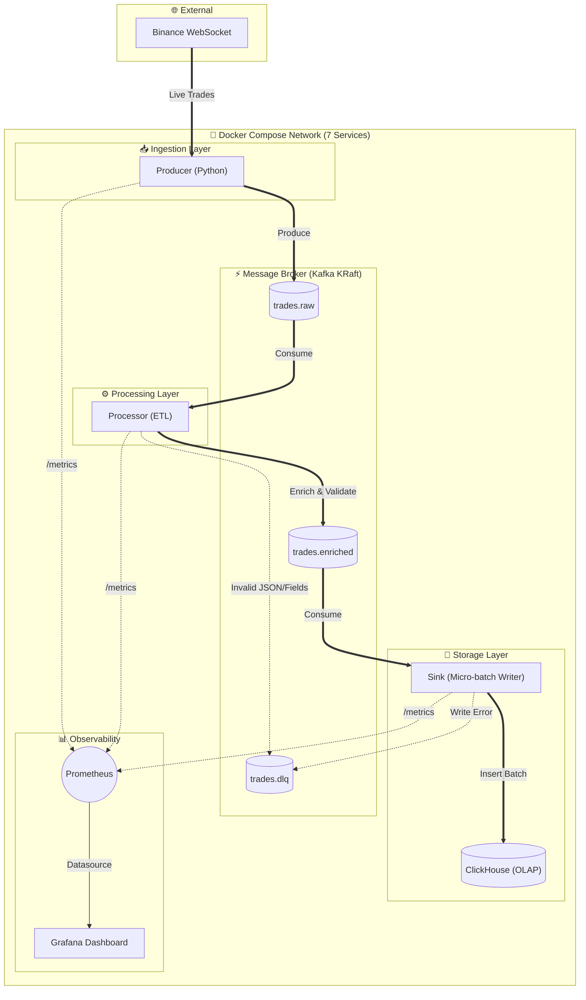

# 📈 Real-time Crypto Trading Pipeline


-231F20?logo=apachekafka&logoColor=white)


Hệ thống **data pipeline real-time** hoàn chỉnh từ đầu đến cuối, thu thập dữ liệu giao dịch tiền điện tử từ Binance, xử lý và làm giàu qua Kafka, lưu trữ vào ClickHouse cho phân tích OLAP hiệu suất cao — toàn bộ được giám sát bằng Prometheus & Grafana.

---

## 🏗️ Kiến trúc hệ thống



### Luồng dữ liệu

| Giai đoạn | Thành phần | Mô tả |
|:---:|---|---|
| 1 | **Producer** | Kết nối Binance qua WebSocket, stream dữ liệu giao dịch đa symbol vào `trades.raw` |
| 2 | **Processor** | Consume raw trades, validate & tính toán `notional_value`, đẩy vào `trades.enriched` |
| 3 | **Sink** | Gom nhóm micro-batch (500 records / 2 giây) để ghi vào ClickHouse hiệu suất cao |
| ↳ | **DLQ** | Message lỗi được chuyển vào `trades.dlq` kèm thông tin lỗi để điều tra sau |

---

## ✨ Tính năng nổi bật

### Độ tin cậy & Chịu lỗi
- **At-least-once delivery** — Commit offset thủ công đảm bảo không mất dữ liệu
- **Exponential backoff reconnection** — Producer tự phục hồi khi WebSocket đứt (tối đa 10 lần retry, delay lên đến 60 giây)
- **Dead Letter Queue** — Message lỗi được chuyển vào `trades.dlq` kèm payload gốc + context lỗi
- **Graceful shutdown** — Xử lý SIGTERM, flush hết dữ liệu đang xử lý trước khi tắt, tránh mất dữ liệu khi deploy

### Hiệu suất & Khả năng mở rộng
- **Micro-batch writes** — Gom nhóm tới 500 records mỗi lần ghi ClickHouse, tối đa hóa throughput
- **Backpressure control** — Buffer giới hạn 10.000 records; tạm dừng consume khi downstream gặp sự cố, tránh OOM
- **Lưu trữ OLAP dạng cột** — ClickHouse `MergeTree` engine, tối ưu cho time-series với `ORDER BY (symbol, trade_time_ms)`
- **Tự động xóa dữ liệu cũ** — TTL policy tự động xóa dữ liệu quá 30 ngày

### Giám sát (Observability)
- **Structured logging** — Format log chuẩn với severity levels trên toàn bộ services
- **Prometheus metrics** — Custom counters theo dõi throughput, lỗi, reconnects, batch writes
- **Grafana dashboard tự động** — Dashboard 11 panel được provision sẵn, không cần setup thủ công

### Production Hardening
- **Health checks** — Kafka và ClickHouse phải healthy trước khi các service phụ thuộc khởi động
- **Restart policies** — Infrastructure: `unless-stopped`; Application: `on-failure`
- **Resource limits** — Giới hạn memory cho từng container, tránh tranh chấp tài nguyên
- **Data persistence** — Docker volumes cho Kafka, ClickHouse, Grafana đảm bảo dữ liệu không mất khi restart
- **CI/CD** — GitHub Actions: lint (Ruff) → test (pytest) → Docker build verification

---

## 🛠️ Công nghệ sử dụng

| Tầng | Công nghệ | Lý do chọn |
|---|---|---|
| **Thu thập dữ liệu** | Python + `websockets` | Async I/O xử lý WebSocket throughput cao |
| **Message Broker** | Apache Kafka 3.7 (KRaft) | Decouple services, buffer bền vững, không cần Zookeeper |
| **Xử lý dữ liệu** | Python + `confluent-kafka` | ETL nhẹ với kiểm soát offset thủ công |
| **Kho dữ liệu (OLAP)** | ClickHouse 24.11 | Engine OLAP dạng cột nhanh nhất cho phân tích time-series |
| **Giám sát** | Prometheus + Grafana | Tiêu chuẩn công nghiệp cho thu thập metrics và trực quan hóa |
| **Triển khai** | Docker Compose | Khởi chạy toàn bộ 7 services bằng một lệnh duy nhất |
| **CI/CD** | GitHub Actions | Tự động kiểm tra lint, chạy test và verify Docker build |

---

## 📁 Cấu trúc dự án

```
finance-pipeline/
├── .github/workflows/
│   └── ci.yml                    # CI pipeline: lint → test → docker build
├── grafana/
│   ├── dashboards/
│   │   └── crypto_pipeline.json  # Dashboard 11 panel tự động provision
│   └── provisioning/
│       ├── dashboards/           # Cấu hình dashboard provider
│       └── datasources/          # Cấu hình datasource Prometheus
├── services/
│   ├── producer/
│   │   ├── Dockerfile
│   │   ├── producer.py           # WebSocket → Kafka ingestion
│   │   └── requirements.txt
│   ├── processor/
│   │   ├── Dockerfile
│   │   ├── processor.py          # ETL: validate, enrich, route
│   │   ├── transform.py          # Logic enrichment thuần (testable)
│   │   └── requirements.txt
│   └── sink/
│       ├── Dockerfile
│       ├── sink.py               # Kafka → ClickHouse micro-batch writer
│       ├── batch.py              # Logic build rows thuần (testable)
│       └── requirements.txt
├── tests/
│   ├── test_transform.py         # 9 tests: logic enrichment
│   └── test_batch.py             # 5 tests: logic build rows
├── scripts/
│   └── ingestion_prototype.py    # Prototype WebSocket ban đầu (tham khảo)
├── docker-compose.yml            # Orchestration 7 services
├── prometheus.yml                # Scrape config cho 3 app services
├── pyproject.toml                # Cấu hình Ruff + pytest
├── commands.ps1                  # Các lệnh CLI hữu ích cho Kafka & ClickHouse
├── .env.example                  # Template biến môi trường
└── .gitignore
```

---

## 🗄️ Schema dữ liệu

```sql
CREATE TABLE trades (
    symbol          String,
    price           Float64,
    quantity        Float64,
    notional_value  Float64,          -- Tính toán: price × quantity
    trade_time_ms   UInt64,
    trade_time      DateTime DEFAULT toDateTime(intDiv(trade_time_ms, 1000))
) ENGINE = MergeTree()
ORDER BY (symbol, trade_time_ms)
TTL trade_time + INTERVAL 30 DAY     -- Tự xóa sau 30 ngày
```

---

## 🚀 Hướng dẫn cài đặt & chạy

### Yêu cầu
- Đã cài đặt [Docker](https://docs.docker.com/get-docker/) & [Docker Compose](https://docs.docker.com/compose/install/)

### 1. Cấu hình môi trường

```bash
cp .env.example .env
# Chỉnh sửa .env: đặt mật khẩu ClickHouse và các symbol Binance muốn theo dõi
```

### 2. Khởi chạy pipeline

```bash
docker compose up --build -d
```

### 3. Kiểm tra hệ thống

| Dịch vụ | URL | Tài khoản |
|---|---|---|
| **Grafana Dashboard** | [localhost:3000](http://localhost:3000) | `admin` / `admin` |
| **Prometheus** | [localhost:9090](http://localhost:9090) | — |
| **ClickHouse HTTP** | [localhost:8123](http://localhost:8123) | `default` / (mật khẩu trong .env) |

```bash
# Kiểm tra trạng thái containers
docker compose ps

# Xem log producer real-time
docker compose logs -f producer

# Đếm số bản ghi trong ClickHouse
curl "http://localhost:8123/?query=SELECT+count()+FROM+trades"
```

### 4. Dừng hệ thống

```bash
docker compose down       # Dừng services (dữ liệu giữ nguyên trong volumes)
docker compose down -v    # Dừng + xóa toàn bộ dữ liệu
```

---

## 📊 Giám sát (Monitoring)

Dashboard Grafana được **tự động provision** — không cần setup thủ công trên UI.

**Overview** — 4 stat panels hiển thị throughput real-time và số lỗi

**Producer** — Tốc độ gửi message/giây + theo dõi reconnect WebSocket

**Processor** — Tỉ lệ message xử lý thành công vs thất bại + đếm lỗi tích lũy

**Sink** — Tốc độ ghi ClickHouse + tần suất batch + đếm lỗi ghi

### Bảng tham chiếu Prometheus Metrics

| Metric | Service | Loại | Mô tả |
|---|---|---|---|
| `producer_messages_produced_total` | Producer | Counter | Số message đã gửi vào Kafka |
| `producer_websocket_reconnects_total` | Producer | Counter | Số lần reconnect WebSocket |
| `processor_messages_processed_total` | Processor | Counter | Số message đã enrich thành công |
| `processor_messages_failed_total` | Processor | Counter | Số message lỗi validation |
| `processor_messages_dlq_total` | Processor | Counter | Số message chuyển vào DLQ |
| `sink_records_written_total` | Sink | Counter | Số records đã ghi vào ClickHouse |
| `sink_batches_written_total` | Sink | Counter | Số batch ghi thành công |
| `sink_write_errors_total` | Sink | Counter | Số lần ghi ClickHouse thất bại |

---

## 🧪 Kiểm thử (Testing)

```bash
# Chạy toàn bộ tests
pytest tests/ -v

# Kiểm tra code style
ruff check .

# Tự động fix lỗi lint
ruff check . --fix
```

**14 test cases** bao phủ logic enrichment và batch-building, bao gồm edge cases (thiếu field, giá trị không hợp lệ, chuyển đổi kiểu dữ liệu, input rỗng).

---

## 🔮 Hướng phát triển tương lai

- [ ] **Schema Registry** — Avro/Protobuf schemas cho Kafka message contracts
- [ ] **dbt Integration** — Tầng xử lý SQL chuyên sâu bên trong ClickHouse cho phân tích tổng hợp
- [ ] **Alerting** — Grafana alert rules khi error rate tăng đột biến hoặc throughput giảm
- [ ] **Kubernetes** — Helm charts để triển khai trên K8s cho môi trường production
- [ ] **Multi-exchange** — Hỗ trợ WebSocket feeds từ Coinbase, Kraken, OKX

---

## 📄 Giấy phép

Dự án mã nguồn mở theo [MIT License](LICENSE).
