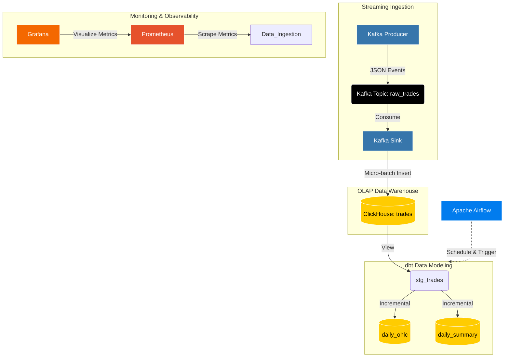

# 🚀 Real-time Crypto Data Pipeline


Một hệ thống dữ liệu hoàn chỉnh (End-to-End Data Engineering Project) thu thập, xử lý và trực quan hóa dữ liệu giao dịch tiền điện tử theo thời gian thực (Real-time). Dự án được thiết kế theo kiến trúc **Modern Data Stack (MDS)** với khả năng xử lý hàng chục nghìn giao dịch mỗi giây, cực kỳ tối ưu về tốc độ và chi phí.

---

## 🏛 Kiến trúc Hệ thống (Architecture)



### 🧩 Các thành phần cốt lõi:
1. **Source**: Trình mô phỏng (Mock Data Generator) tạo luồng dữ liệu giả lập giống API của Binance.
2. **Streaming Bus**: Apache Kafka (Lưu trữ đệm luồng dữ liệu thô với độ trễ thấp).
3. **Data Warehouse**: ClickHouse (Lưu trữ cột, là điểm đến cuối cùng chứa dữ liệu đã được làm sạch và tổng hợp).
4. **Data Transformation**: dbt (Data Build Tool) chuẩn hóa và tổng hợp dữ liệu trong ClickHouse.
5. **Orchestration**: Apache Airflow (Lên lịch và kích hoạt các dbt pipelines).
6. **Monitoring**: Prometheus (Thu thập metrics) & Grafana (Theo dõi sức khỏe hệ thống, băng thông Kafka, v.v.).

---

## 🌟 Điểm nhấn Kỹ thuật (Highlight Features)

- **Micro-batching tối ưu hóa cho ClickHouse:** Dữ liệu không được ghi từng dòng vào Database (tránh phá vỡ cơ chế `MergeTree`). Thay vào đó, Consumer gom dữ liệu thành các batch (Micro-batching) 500 dòng hoặc định kỳ lưu mỗi 2 giây/lần.
- **Incremental Materialization (Xử lý gia tăng):** Các bảng báo cáo (`daily_ohlc`, `daily_summary`) được xây dựng bằng dbt với chế độ `incremental`. Khi Airflow gọi dbt, hệ thống chỉ tính toán trên lượng dữ liệu mới sinh ra của **ngày hôm nay**, giúp tiết kiệm 99% tài nguyên máy chủ.
- **Tách biệt Storage và Compute:** Áp dụng triết lý thiết kế ELT (Extract, Load, Transform), mọi thao tác xử lý phức tạp đều được đẩy xuống Engine siêu tốc của ClickHouse giải quyết.

---

## 📂 Cấu trúc Thư mục

```text
finance-pipeline/
├── airflow/                   # Cấu hình DAGs và Airflow Dockerfile
│   └── dags/                  # Các luồng công việc (Orchestration logic)
├── dbt/finance_project/       # Mã nguồn dbt
│   ├── models/                
│   │   ├── staging/           # Làm sạch dữ liệu (stg_trades)
│   │   └── marts/             # Dữ liệu phục vụ nghiệp vụ (daily_ohlc, daily_summary)
│   └── dbt_project.yml        # Cấu hình dbt
├── kafka/                     # Mã nguồn xử lý luồng dữ liệu
│   ├── producer/              # Đẩy dữ liệu vào Topic
│   ├── processor/             # (Tùy chọn) Xử lý trung gian
│   └── sink/                  # Hút dữ liệu từ Topic đẩy vào ClickHouse
├── grafana/                   # Cấu hình Grafana tự động (Provisioning)
├── prometheus.yml             # Cấu hình Monitoring
└── docker-compose.yml         # Triển khai toàn bộ hạ tầng
```

---

## 🛠 Hướng dẫn Khởi chạy (Quick Start)

### Yêu cầu hệ thống:
- Docker & Docker Compose cài đặt sẵn.
- Tối thiểu 8GB RAM (Đề xuất 16GB) do chạy đồng thời Kafka, ClickHouse, Airflow.

### 1. Khởi động Hạ tầng
Di chuyển vào thư mục dự án và khởi động bằng Docker Compose:
```bash
docker compose up -d --build
```
*Hệ thống sẽ tải image và khởi động 9 containers khác nhau (Kafka, ClickHouse, Airflow, Các tiến trình Python, v.v.). Quá trình này có thể mất vài phút.*

### 2. Kiểm tra Trạng thái
Hãy chắc chắn rằng tất cả các container đều hiển thị `Up` hoặc `Healthy`:
```bash
docker compose ps
```

### 3. Khởi tạo Cơ sở Dữ liệu (Dạy dbt tạo bảng)
Bản chất ClickHouse ban đầu chỉ có bảng Raw (`trades`). Chúng ta cần kích hoạt dbt lần đầu để nó biên dịch và tạo ra các bảng tổng hợp.
Truy cập vào container Airflow và chạy lệnh sau:
```bash
docker compose exec airflow bash -c "dbt run --project-dir /opt/dbt/project --profiles-dir /opt/dbt/project"
```
*Kết quả thành công sẽ hiển thị thông báo `PASS=3`.*

---

## 🖥 Điểm truy cập các Dịch vụ

Khi mọi thứ đã `Running`, bạn có thể kiểm tra hệ thống qua các cổng sau (truy cập bằng trình duyệt `localhost`):

| Dịch vụ | URL | Đăng nhập (Mặc định) | Ghi chú |
|---------|-----|----------------------|---------|
| **Grafana** (Monitoring) | [http://localhost:3000](http://localhost:3000) | `admin` / `admin` | Giám sát sức khỏe hệ thống (Kafka throughput, Node metrics) |
| **Apache Airflow** (Orchestration)| [http://localhost:8080](http://localhost:8080) | `admin` / `admin` | Kích hoạt và theo dõi tiến trình dbt |
| **Prometheus** (Monitoring) | [http://localhost:9090](http://localhost:9090) | *(Không yêu cầu)* | Viết câu lệnh PromQL để xem Metrics |

---
